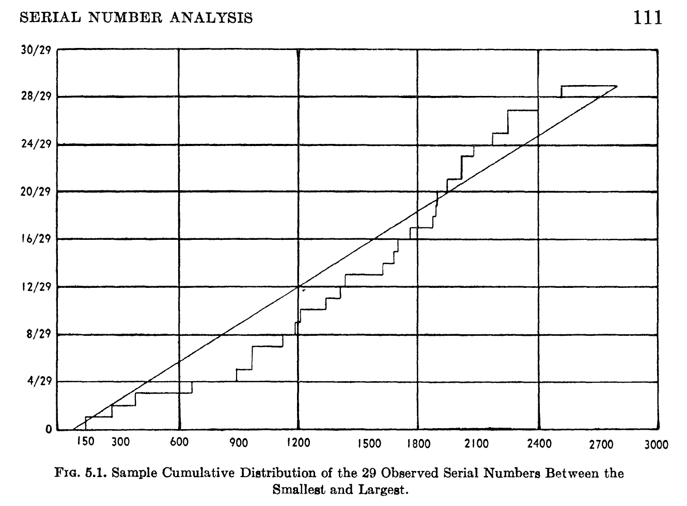

# Some Practical Techniques in Serial Number Analysis

Looking at Section 5, _An Application_ of
Leo A. Goodman (1954) Some Practical Techniques in Serial
Number Analysis, Journal of the American Statistical Association, 49:265, 97-112

## Raw Data

Goodman's data is 31 serial numbers in 3 lines of text,

```
83, 135, 274, 380, 668, 895, 955, 964, 1113, 1174, 1210, 1344, 1387, 1414,
1610, 1668, 1689, 1756, 1865, 1874, 1880, 1936, 2005, 2006, 2065, 2157, 2220,
2224, 2396, 2543, 2787
```

Goodman figures out two basic things about the data:

1. How large was the initial purchase of serial numbered items?
2. How close to a uniform distribution is this group of serial numbers?

### Estimate of how many items were purchased and numbered

Goodman's formula for estimating how many items got serial numbered is:

p = d(k+1)/(k-1) - 1

- **p** is "total production", the number of items that really got serial numbered
- **d** is the numerical difference between maximum and minimum serial number
- **k** is the number of serial numbers

p = (2787 - 83)(31+1)/(31-1) - 1 = 2883.3

### How close to a uniform distribution

In section 3.2.4 of his paper, page numbered 108, Goodman 
decides that a difference of 8 from a "continuous distribution"
to a "cumulative distribution" means that the serial number
sample matches the continuous distribution closely enough.

The cumulative distribution is just the count so far of
numerically ordered serial numbers, 1-indexed.
His 31 serial numbers end up with a cumulative distribution like this:

```
83  0
135 1
274 2
380 3
...
2396 28
2543 29
2787 30
```

His continuous distribution is a line from (83,0) to (2787.30)

There's only one graphic in Goodman (1954), which shows cumulative
and continuous distributions.



## Simulation
