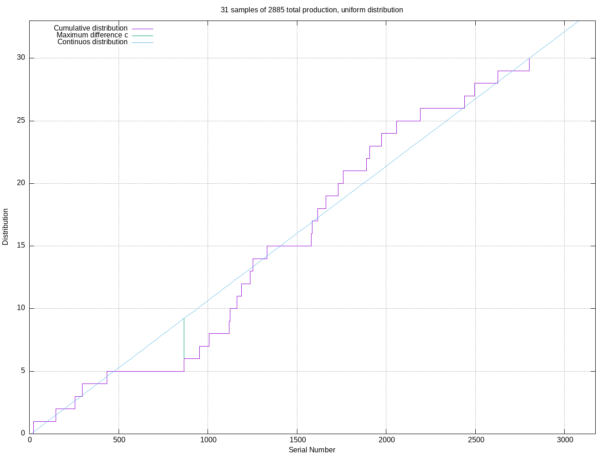

# Some Practical Techniques in Serial Number Analysis

Looking at Section 5, _An Application_ of
Leo A. Goodman (1954) Some Practical Techniques in Serial
Number Analysis, Journal of the American Statistical Association, 49:265, 97-112

## Raw Data

Goodman's data is 31 serial numbers in 3 lines of text,

```
83, 135, 274, 380, 668, 895, 955, 964, 1113, 1174, 1210, 1344, 1387, 1414,
1610, 1668, 1689, 1756, 1865, 1874, 1880, 1936, 2005, 2006, 2065, 2157, 2220,
2224, 2396, 2543, 2787
```

Goodman figures out two basic things about the data:

1. How large was the initial purchase of serial numbered items?
2. How close to a uniform distribution is this group of serial numbers?

### Estimate of how many items were purchased and numbered

Goodman's formula for estimating how many items got serial numbered is:

p = d(k+1)/(k-1) - 1

- **p** is "total production", the number of items that really got serial numbered
- **d** is the numerical difference between maximum and minimum serial number
- **k** is the number of serial numbers

p = (2787 - 83)(31+1)/(31-1) - 1 = 2883.3

### How close to a uniform distribution

In section 3.2.4 of his paper, page numbered 108, Goodman 
decides that a difference of 8 from a "continuous distribution"
to a "cumulative distribution" means that the serial number
sample matches the continuous distribution closely enough.

The cumulative distribution is just the count so far of
numerically ordered serial numbers, 1-indexed.
His 31 serial numbers end up with a cumulative distribution like this:

```
83  0
135 1
274 2
380 3
...
2396 28
2543 29
2787 30
```

His continuous distribution is a line from (83,0) to (2787.30)

There's only one graphic in Goodman (1954), which shows cumulative
and continuous distributions.


## Simulation

I wrote a [program](sns.go) to simulate sampling serial numbers from a linear sequence.

```
  -T    tab separated value output on stdout
  -g    gnuplot output on stdout
  -k int
        desired number of serial numbers (default 1000)
  -m float
        desired mean serial number (default 1443)
  -p int
        total production (default 10000)
  -r int
        how many trials to run (default 1)
  -s float
        desired standard deviation (default 100)
  -t string
        serial number distribution, "uniform", "normal" (default "uniform")
```

Tab separated value columns are:

1. total production
2. number of serial numbers sampled
3. mean, only relevant for "normal" distribution
4. std dev, only relevant for "normal" distribution
5. distribution, "normal" or "uniform"
6. estimated production
7. slope
8. y-offset  Slope and y-offset define a line, Goodman's "continuous destribution"
9. serial number that has largest distance from that line
10. the largest distance from the line
11. largest difference/number of samples
12. step, y-value of cumulative distribution at serial number value, column 9
13. serial number list, comma separated

Tab separated value output and [gnuplot](http://gnuplot.info/) output
can't be done in the same run.

It will only do multiple repetitions for tab separated value output

Mean and standard deviation are only relevant for `-t normal`
runs.

To get an image file from a simulation:

```
$ go build sns.go
$ ./sns -k 31 -p 2885 -g | gnuplot
$ ls -l goodman1954_uniform.png
-rw-r--r-- 1 bediger bediger 43293 Jun 17 21:47 goodman1954_uniform.png
```

You will get an image similar to this:


